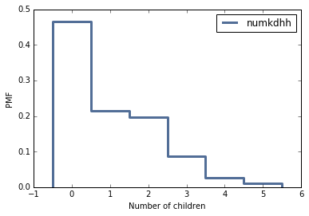

[Think Stats Chapter 3 Exercise 1](http://greenteapress.com/thinkstats2/html/thinkstats2004.html#toc31) (actual vs. biased)

```python
from __future__ import print_function, division
import nsfg
import thinkstats2
import thinkplot


def BiasPmf(pmf, label):
    new_pmf = pmf.Copy(label=label)

    for x, p in pmf.Items():
        new_pmf.Mult(x, x)

    new_pmf.Normalize()
    return new_pmf


resp = nsfg.ReadFemResp()

pmf = thinkstats2.Pmf(resp.numkdhh, label='numkdhh')
thinkplot.Pmf(pmf)
thinkplot.Config(xlabel='Number of children', ylabel='PMF')
biased = BiasPmf(pmf, label='biased')
thinkplot.PrePlot(2)
thinkplot.Pmfs([pmf, biased])
thinkplot.Config(xlabel='Number of children', ylabel='PMF')

pmf.Mean()
biased.Mean()

```



The acutal mean is 1.0, while the biased mean is 2.4. That's a pretty big difference. 
